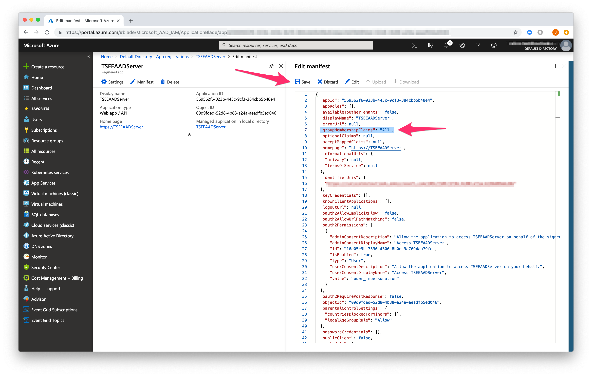
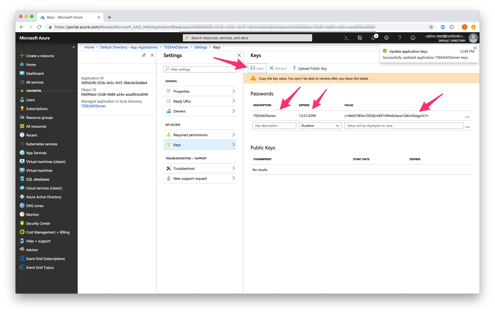

# Integrate Azure Active Directory with Azure Kubernetes Service

[Instructions](https://docs.microsoft.com/en-us/azure/aks/aad-integration) to set up Active Directory for user authentication are captured here for your convenience.

## [Create server application](https://docs.microsoft.com/en-us/azure/aks/aad-integration#create-server-application)

Select Azure Active Directory > App registrations > New application registration.

Give the application a name, select Web app / API for the application type, and enter any URI formatted value for Sign-on URL. Select Create when done.

Select edit Manifest.

Edit the groupMembershipClaims value to "All". Save the updates once complete.

Back on the Azure AD application, select Settings > Keys.

Add a key description, select an expiration deadline, and select Save. Take note of the key value. When deploying an Azure AD enabled AKS cluster, this value is referred to as the `Server application secret`.

Return to the Azure AD application, select Settings > Required permissions > Add > Select an API > Microsoft Graph > Select.

Under `APPLICATION PERMISSIONS` place a check next to `Read directory data`.

Under `DELEGATED PERMISSIONS`, place a check next to `Sign in and read user profile` and `Read directory data`. Save the updates once done.

Choose `Microsoft Graph` from the list of APIs, then select Grant Permissions. This step will fail if the current account is not a tenant admin.

Return to the application and take note of the Application ID. When deploying an Azure AD-enabled AKS cluster, this value is referred to as the `Server application ID`.

## [Create client application](https://docs.microsoft.com/en-us/azure/aks/aad-integration#create-client-application)

Select Azure Active Directory > App registrations > New application registration.

Give the application a name, select Native for the application type, and enter any URI formatted value for Redirect URI. Select Create when done.

From the Azure AD application, select Settings > Required permissions > Add > Select an API and search for the name of the server application created in the last step of this document.

Place a check mark next to the application and click Select.

Select your server API from the list and then choose Grant Permissions.

Back on the AD application, take note of the Application ID. When deploying an Azure AD-enabled AKS cluster, this value is referred to as the `Client application ID`.

## [Get tenant ID](https://docs.microsoft.com/en-us/azure/aks/aad-integration#get-tenant-id)

Finally, get the ID of your Azure tenant. This value is also used when deploying the AKS cluster.

From the Azure portal, select Azure Active Directory > Properties and take note of the Directory ID. When deploying an Azure AD-enabled AKS cluster, this value is referred to as the Tenant ID.

